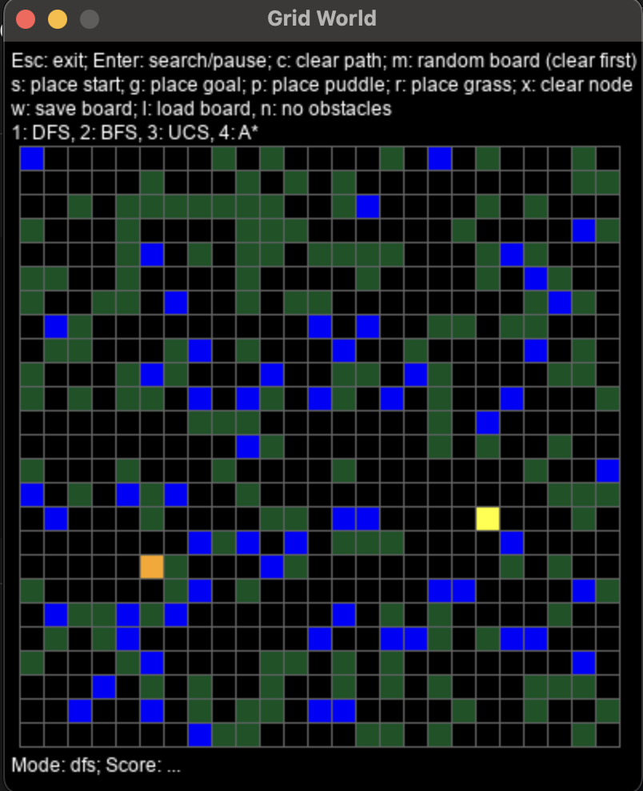

# Project 1: Grid World Pathfinding

**Language**: Python  
**Library**: PyGame  
_Code not published due to academic integrity policy._

---

## What I Did

- Fixed bugs in the given DFS implementation
- Implemented Breadth-First Search (BFS), Uniform Cost Search (UCS), and A* Search from scratch
- Designed and tested the algorithms on 20+ map cases, including custom patterns like spiral and zigzag
- Used a priority queue to optimize A* and UCS performance

---

## Problem & Solutions

- Implementing UCS
  - Problem: I initially stored frontier nodes in a simple list rather than a priority queue, leading to incorrect expansions and non-optimal paths, especially when "grass" tiles (cost = 10) appeared.
  - Solution: I refactored UCS to use `heapq` for priority-based selection and maintained a dictonary to track the lowest known cost per node. UCS produced the correct minimal-cost paths on all provided test cases, including those with mixed terrain costs.
 
- Implementing and Tuning A* Search
  - Problem: My first A* version didn't properly integrate the heuristic with the path cost; I only compared heuristic values without combining them with the actual travel cost.
  - Solution: I corrected the priority calculation to `f = g + h` and used Manhattan distance as the heuristic (`abs(dx) + abs(dy)`). Then, I verified the heuristic's admissibility and compared it against UCS outputs to confirm that A* was both optimal and faster in most maps.

---

## What I Learned

- Algorithmic Thinking in Pathfinding: I learned how different search strategies (DFS, BFS, UCS, A*) balance exporations vs. exploitation, and how algorithm design choices directly affect both path optimality and runtime performance. Implementing each from scratch helped me internalize how frontier management, cost tracking, and heuristics define the behavior of intelligent agents.
- Practical Debugging and Optimization: Fixing the given buggy DFS taught me how small logic errors can completely break search correctness. Through debugging, I improved my ability to isolate algorithmic vs. visualization issues and learned to use incremental testing and print-based tracing effectively.

---

## Output

---

## Demonstration

▶️ [Click here to watch the video on YouTube!](https://youtube.com/shorts/UFhhSYBn1C4?feature=share)
