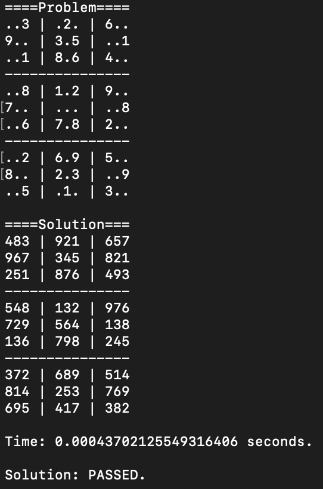

# Project 5: Sudoku – Constraint Solver & SAT Encoding

**Language**: Python
_Code not published due to academic integrity policy._

---

## What I Did

- Implemented a **Constraint Satisfaction Problem (CSP)** solver for Sudoku using:
  - Constraint propagation
  - Backtracking search
  - Minimum Remaining Values (MRV) heuristic

---

## Problems & Solutions

- Variable Selection Heuristic
  - Problem: Naively choosing the first unassigned cell resulted in slow progress on large search trees.
  - Solution: I added the MRV heuristic to select the unassigned variable with the smalles domian `len(D[x])` minimum. This reduced branching dramatically and cut runtime by ~70% on hard instances (`-t3` tests).

---

## What I Learned

- Heuristics in Constraint Satisfaction: I gained intuition for how MRV and forward checking impact performance.
- CNF Encoding and SAT Solvers: I practiced translating logical constraints into Boolean form and interpreting SAT outputs.

---

## Output

